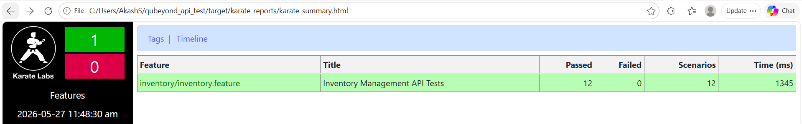

# Home Test API - Assignment Test Suite

**🔗 GitHub Repository:** [singhsaab19/automation-api-test-suite](https://github.com/singhsaab19/automation-api-test-suite)  
**📊 Live Report Dashboard:** [View CI/CD Test Results](https://singhsaab19.github.io/automation-api-test-suite/)

This repository contains the automated API test suite for the `automaticbytes/demo-app` using [Karate](https://github.com/karatelabs/karate) and Java/Maven.

---

## 🚀 Design Decisions & Bonus Features

* **Idempotency (Multiple Executions):** Rather than hardcoding IDs for the POST requests, the test suite utilizes a custom Java utility class (`utils.DataGenerator`) invoked natively from the Karate feature files. This generates dynamic, randomized 4-digit IDs at runtime. This ensures a unique item is created on every test execution, allowing the CI/CD pipeline and local tests to run infinitely without requiring manual database cleanup, Docker container restarts, or risking data collisions.
* **Environment Agnostic:** Environment variables are managed centrally via `karate-config.js` and dedicated JSON property files inside `src/test/java/config`. The framework can point to `dev`, `qa`, or `prod` dynamically without modifying test logic.
* **Fuzzy Matchers:** Utilized Karate's fuzzy matching (e.g., `#string`, `#notnull`) for robust schema validation that won't break on minor data updates.
* **Data-Driven Testing:** JSON payloads and expected schemas are abstracted from the feature files and stored in a centralized `src/test/resources/testData` directory.
* **Fully Automated CI/CD:** Integrated a complete GitHub Actions pipeline that handles container orchestration, test execution, and dynamic report hosting.

---

## 📂 Project Structure

```text
qubeyond_api_test/
├── pom.xml
├── src/
│   └── test/
│       ├── java/
│       │   ├── karate-config.js
│       │   ├── logback-test.xml
│       │   ├── com/karate/runner/TestRunner.java
│       │   ├── config/
│       │   │   ├── dev.json
│       │   │   └── qa.json
│       │   ├── inventory/
│       │   │   └── inventory.feature
│       │   └── utils/
│       │       └── DataGenerator.java
│       └── resources/
│           └── testData/
│               └── inventory/
│                   ├── expected-item-3.json
│                   ├── inventory-schema.json
│                   └── new-item-payload.json
└── target/ (generated artifacts & reports)
```

🛠️ Prerequisites
Java 17+

Maven 3.8+

Docker (Required to run the application locally)

📦 Local Setup & Execution
Start the API Application:
Open your terminal (or PowerShell) and spin up the Docker container:

```bash
docker pull automaticbytes/demo-app
docker run -d -p 3100:3100 automaticbytes/demo-app
```

Execute the Test Suite:

```bash
# Run all tests against the default QA environment
mvn test

# Run specific subsets of tests using Karate tags (e.g., @smoke)
mvn test "-Dkarate.options=--tags @smoke"

# Run against a specific environment profile (e.g., dev or qa)
mvn test "-Dkarate.env=dev"
```

⚙️ CI/CD Pipeline (GitHub Actions)
This repository utilizes GitHub Actions to ensure continuous integration and reliable regression testing. The pipeline automatically spins up the application via Docker, executes the test suite, and publishes the results.

1. Automated Triggers
Push & Pull Requests: The suite automatically runs on any code merged or pushed to the main or master branches.

Nightly Regression: A cron job is scheduled to execute the full suite every night at 00:00 UTC to monitor application health.

2. Manual Execution (Workflow Dispatch)
You can manually trigger the pipeline and customize the run configuration directly from the GitHub UI:

        Navigate to the Actions tab in this repository.
        
        Select API Regression Test Suite from the left sidebar.
        
        Click the Run workflow dropdown on the right.
        
        Choose your parameters:
        
        Target Environment: Select qa (default), dev, or prod.
        
        Karate Tags: Specify exactly which tests to run (e.g., @smoke, @negative, @inventory or leave default).
        
        Click Run workflow.


📊 Test Automation Reports
Karate natively generates a comprehensive HTML dashboard detailing all API interactions, assertions, and execution times.

Cloud Reports (GitHub Pages): Upon every successful or failed CI/CD run, the pipeline extracts test artifacts and publishes them here: [View CI/CD Test Results](https://singhsaab19.github.io/automation-api-test-suite/)

Local Reports: To view the reports locally after running Maven, open this file in your preferred web browser: target/karate-reports/karate-summary.html

(Windows users can quickly open the local report via PowerShell: Start-Process target\karate-reports\karate-summary.html)
