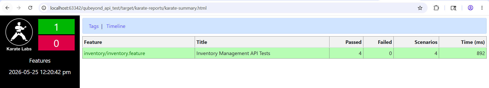

# Home Test API - Inventory Test Suite


> 🌐 **Live Test Dashboard:** [View Passing Reports Dashboard](https://<YOUR_GITHUB_USERNAME>.github.io/<YOUR_REPO_NAME>/karate-summary.html)

This repository contains the automated API test suite for the `automaticbytes/demo-app` using [Karate](https://github.com/karatelabs/karate) and Java/Maven.

## 🚀 Design Decisions & Bonus Features

* **Idempotency (Multiple Executions):** Rather than hardcoding ID "10" for the POST requests, the test suite utilizes a Java `UUID` generator in the `Background` block. This ensures a unique item is created on every test run, allowing the suite to be executed infinitely without requiring manual database cleanup or Docker container restarts.
* **Environment Agnostic:** Environment variables are managed centrally via `karate-config.js` and dedicated JSON property files inside `src/test/java/config`. The framework can point to `dev`, `qa`, or `prod` dynamically without modifying test logic.
* **Fuzzy Matchers:** Utilized Karate's fuzzy matching (e.g., `#string`, `#notnull`) for robust schema validation that won't break on minor data updates.
* **Scenario Isolation:** The item creation, negative duplicate check, and retrieval validation are mapped into a single logical E2E scenario (`@item-lifecycle`) to ensure assertions aren't affected by race conditions or parallel execution.
* **Fully Automated CI/CD:** Integrated a complete GitHub Actions pipeline that handles container orchestration, test execution, and dynamic report hosting.

---

## 🛠️ Prerequisites

* Java 17+
* Maven 3.8+
* Docker (to run the app locally)

---

## 📦 Local Setup Instructions

1. **Start the API:**
   ```bash
   docker pull automaticbytes/demo-app
   docker run -p 3100:3100 automaticbytes/demo-app
   ```

2. **Execute Tests:**

   ```bash
   # Run against default QA environment
   mvn test
   ```

   # Run specific tags
   ```bash
   mvn test "-Dkarate.options=--tags @smoke"
    ```
   # Run against a specific environment (e.g., dev)
   ```bash
   mvn test "-Dkarate.env=dev"
   ```
## CI/CD Pipeline (GitHub Actions)
   This repository utilizes GitHub Actions to ensure continuous integration and reliable regression testing. The pipeline automatically spins up the application via Docker, executes the test suite, and publishes the results. 

   1.Automated Triggers
      Push & Pull Requests: The suite automatically runs on any code merged or pushed to the main or master branches.

   2.Nightly Regression: A cron job is scheduled to execute the full suite every night at 00:00 UTC to monitor application health.

   3.Manual Execution (Workflow Dispatch)
      You can manually trigger the pipeline and customize the run configuration directly from the GitHub UI:
      Navigate to the Actions tab in this repository.

      Select API Regression Test Suite from the left sidebar.

      Click the Run workflow dropdown on the right.

      Choose your parameters:
      
      Target Environment: Select qa (default), dev, or prod.
      
      Karate Tags: Specify exactly which tests to run (e.g., @smoke, @e2e, or leave default).
      
      Click Run workflow.

##Local Reports
To view the reports locally after running Maven:

1. Navigate to target/karate-reports/.

2. Open karate-summary.html in your preferred web browser.
